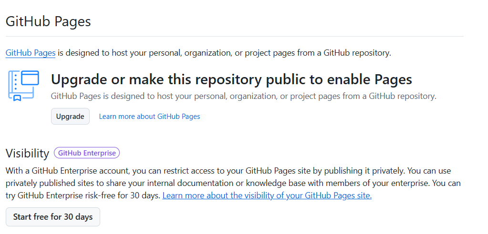
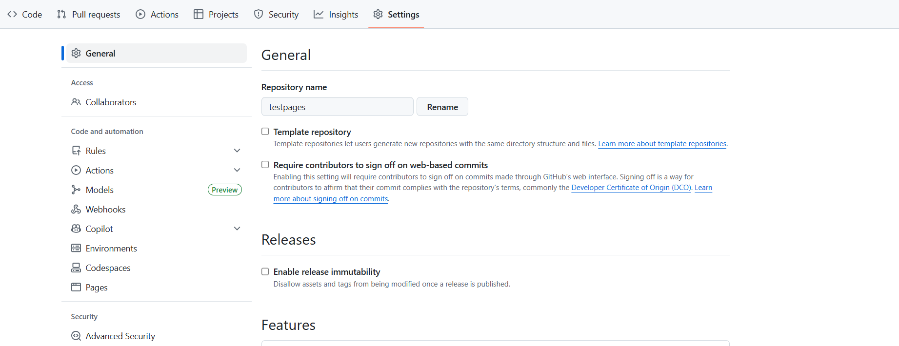
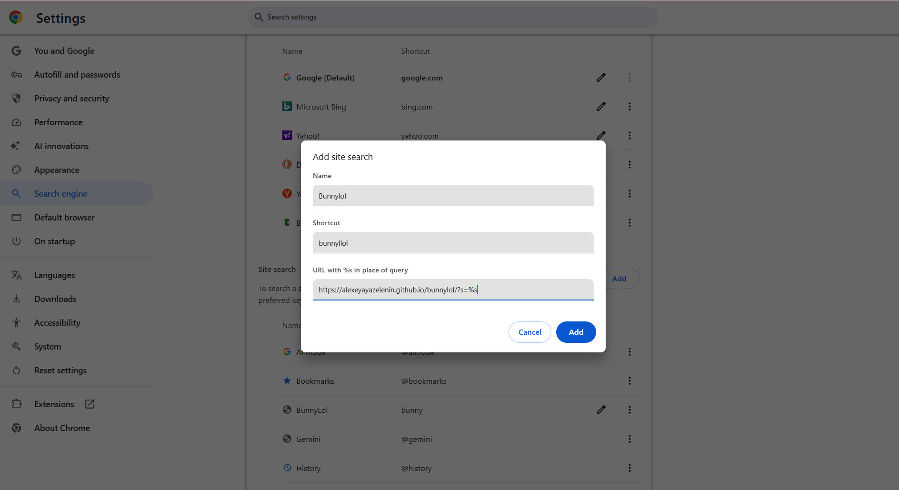
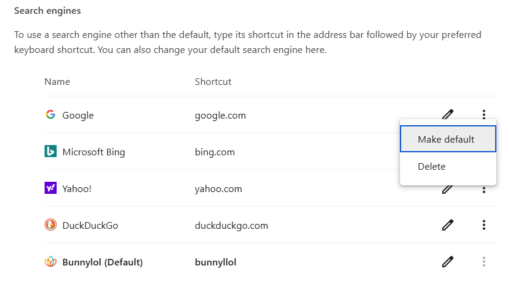
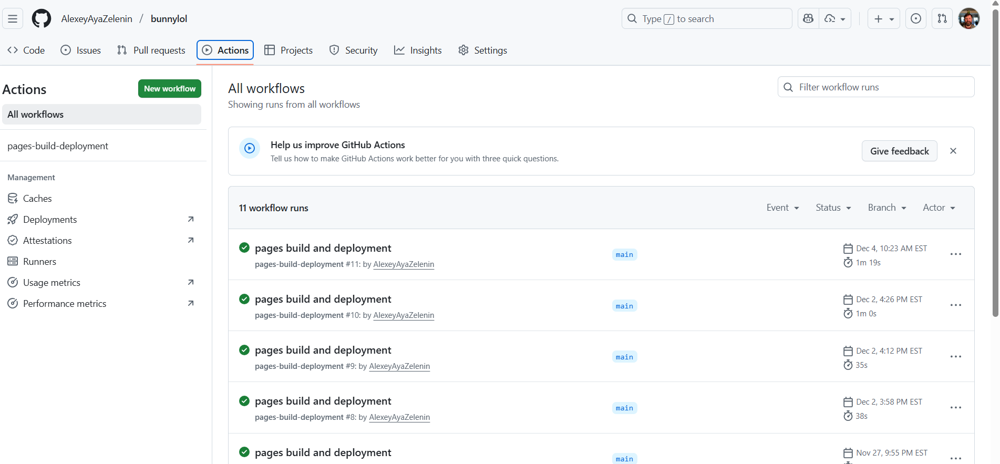

# Bunny Lol - Javascript version

The main purpose of the "bannylol" project is to provide quick and easy "commandline" style of smart bookmarks.

Idea is pretty simple: user types the "comand" with parameters into browser 
query string and gets the result  without long navigation through the bookmarks
or need to remember exact URL.

## One Word Commands
### Examples

- **g** &#8212;
  Leads to the main google page
- **aya** &#8212; 
  Leads to the Main Aya Pulse page
- **cf** &#8212; 
  Leads to the Aya Confluence page
- **jira** &#8212;
  Leads to the Aya Jira page

In addition to the simple one-word commands, you can also use commands with parameters for more specific searches.

## Commands With Parameters
### Examples

- **ticket &lt;ticketId&gt;** &#8212;
  Leads to the specific Jira ticket page. For example, typing **ticket AY-1234** will take you directly 
  to the Jira page for ticket **AY-1234**.
- **nova dev** &#8212;
  Leads to the Aya Nova development environment page <u>https://nova-dev.ayahealthcare.com/</u>
- **nova int** &#8212;
  Leads to the Aya Nova development environment page <u>https://nova-int.ayahealthcare.com/</u>

## Commands With Prefixes
### Examples

- **TCV-1234** &#8212;
  Leads to the specific ticket page in Jira TCV-1234. The prefix **TCV-** is automatically recognized as a ticket command.

## Setup

To setup your own version of the "bunnylol" application, follow these steps:

1. Fork the repository to your own GitHub account.
2. Open repository settings and navigate to the "Pages" section.
3. As "Source", select `Deploy from a branch` and choose the `main` branch.

   - If you get the message about upgrading the repository

    - Simply open the "General" settings

    - Scroll down to the "Danger Zone" section and click the link "Change visibility"
 and confirm the change to "Public"
4. Save the settings. Your application should now be live at `https://<your-github-username>.github.io/bunnylol/`. In my case it's [https://alexeyayazelenin.github.io/bunnylol/](https://alexeyayazelenin.github.io/bunnylol/)
5. If you open this URL in your browser, you should see the list of commands defined in the `commands.js` file.
6. To set up the "smart URL" in your browser, open the settings and navigate to the "Search engine" section.
7. Add a new search engine with the following details:
   - Search engine name: `BunnyLOL` (or any name you prefer)
   - Keyword: `bunnylol` (this will be the keyword you type in the address bar)
   - URL with %s in place of query: `https://<your-github-username>.github.io/bunnylol/?s=%s`

8. Save the new search engine.
9. Make it as "default"\
Later you can change the default search engine back to Google or any other you like.



## Commands List

All the commands are defined in the `commands.js` file. You can edit this file to add, remove, or modify commands as needed.

Each command is represented by JSON object with the following structure:

```javascript
{
    "commandKey": {
        "name": "Command Name",
        "pfefix": "optionalPrefix", // optional
        "searchUrl": "https://example.com/search?q={query}", // optional
        "url": "https://example.com/search?q={query}",
        "description": "Description of the command" // optional
    }
}
```

- `commandKey`: The keyword that triggers the command. First, engine searches for exact match (command, following the space), then for prefix match - when query string starts with the prefix defined in the command.
- `name`: A human-readable name for the command.
- `prefix`: (optional) A prefix that can be used to trigger the command. Added just for convenience, when we have ticket ID as a string and don't want to manually replace `TCV-4432` with `ticket TCV-4432`, or even `TCV 4432`.
- `searchUrl`: (optional) URL template for search queries. If defined, this URL will be used when the command is followed by a search query. If search query is not provided, the `url` will be used instead.
- `url`: URL template for the command. This URL will be used when the command is triggered without a search query or when `searchUrl` is not defined. Both `url` and `searchUrl` can use
  - `%s` as a placeholder for the whole search string following the command.
  - `{0}`, `{1}`, ... as placeholders for individual words in the search string.
- `description`: (optional) A brief description of what the command does. This is used in the commands list display.

If command is not found or not defined, script will display the list of all available commands.

> Note: If `commands.js` file is modified, you need to commit and push the changes to your GitHub repository for them to take effect in your live application. Github will automatically redeploy the application when changes are detected in the repository. The process can be tracked in the "Actions" tab of your repository.
> 
> Please remember that it might take a few minutes for the changes to be reflected in the live application after pushing the changes to GitHub even after "build and deployment" action is completed successfully.